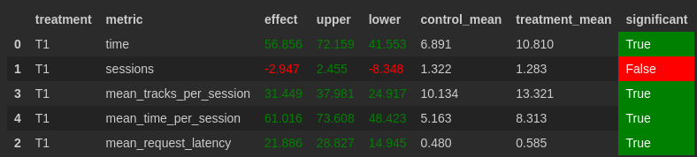

# Домашнее задание. Рекомендер музыкальных треков.

# Инструкция

1. Подготовить модуль симуляции: [Модуль sim](sim) пункты 1-3 (в инструкции) 
2. Поднять контейнер: [Модуль botify](botify) пункты 2-4 (в инструкции)
3. Запуск симулятора: [Модуль sim](sim) 5-ый пункт (в инструкции)
   ```
   python sim/run.py --episodes 1000 --config config/env.yml single --recommender remote --seed 31337 
   ```
4. Скоппировать собранные данные из докера: [Модуль botify](botify)
   ```
   docker cp recommender-container:/app/log/ ../test-data
   ```
5. Запустить A/B-test: Для этого надо заново прогнать [Week1Seminar.ipynb](jupyter/Week1Seminar.ipynb)

# Отчёт

#

### Основная идея эксперемента:
Модифицируем исходный рекомендер `Contextual`.

Будем для каждой пользователя хранить наборы рекомендационных коэффициентов по каждому треку.
И потом на основе этих коэффициентов (пропорционально) будем случайно выбирать следующий трек.

По умолчанию всем трекам соответсвует нулевой коффициент и соответсвенно нулевая вероятность стать выбранным.
Но если пользователь прослушал некий трек, 
то те треки которые должны были рекомендоваться в `Contextual` для прослушанного трека
получают некий `бонус`. Этот `бонус` может как увеличить так и уменьшить рекомендационный коэффициент).
При этом `бонус` прямо зависит от метрики `reward` для соответствующего трека

#

### Детали:

Сам рекомендер находтся в файле [solution.py](botify/botify/recommenders/solution.py)

Будем хранить словарь с ключами пользователями и треками. Значения в этом словаре и будут нашими
рекомендационными коэффициентами

###

Подробнее посмотрим на то, что происходит в моём рекомендере `Solution`, когда он получает 
информацию о предыдущем прослушанном треке: 

Мы получаем рекмендации из [recommendations.json](botify/data/recommendations.json), также как это происходит в 
`Contextual`. Для каждого из полученных предрекомендованных треков мы обновляем
рекомендационный коэффициент в нашем словаре, по следующей формуле:

```
self.sum_recs[user][track] *= metric_value * cross_cofficient
self.sum_recs[user][track] += metric_value ** metric_degree / rec_size
```

Где:

`metric_value` - это `reward` для соотвествующего прослушанного трека

`rec_size` - это размер списка предрекомендаций. Его использование позволяет уравнять для двух треков
с одинаковым `reward`, но различных по размеру списка предрекомендаций, их влияние на рекмендации

`metric_degree` - это константа (default=2). Позволяет уменьшить положительное влияние бонусов для треков с маллым `reward`

`cross_cofficient` - это константа (default=1.25). Позволяет значительно увеличитвать рекомендационные коэффициенты
для тех треков, которые уже несколько раз попадают в список предрекомендаций у треков с большим `reward`.
При этом `metric_value * cross_cofficient` позволяет уменьшать рекомендациии тех треков, которые попадют в подборки
к трекам с маллым `reward`

#

К тому же был использован `TopPop` в качестве дефолтного рекомендера (`fallback`) вместо `Random`.
Это не должно играть принципиальной роли, ведь такой рекомендер не должен быть вызываем слишком часто
(иначе у нас явно что-то не то).
Однако кажется использование `TopPop` в данной ситуации, даст лучший результат.

#

### Результаты A/B эксперимента:

В таблице выше видно, что моё решение увtлечивает результат показанный рекомендером `Contextual` на метрике
в среднем на величину в `61.016%` с доверительным интервалом `(73.608; 48.423)`

И т.к. нижняя граница доверительного интервала выше нуля,
то при выбранной выбранной доверительной вероятности равной `0.95` (`alpha = 0.05`)
мы можем утверждать, что моя модификация показывает лучший результат

1. Отчет размером в одну страничку (пожалуйста!), содержащий:
   1. Abstract: основную идею эксперимента (1 параграф)
   2. Детали: минимум того, что нужно знать, чтобы разобраться в реализации (1-2 параграфа + диаграмма)
   3. Результаты A/B эксперимента - в табличке как на семинарах (1 параграф + табличка)